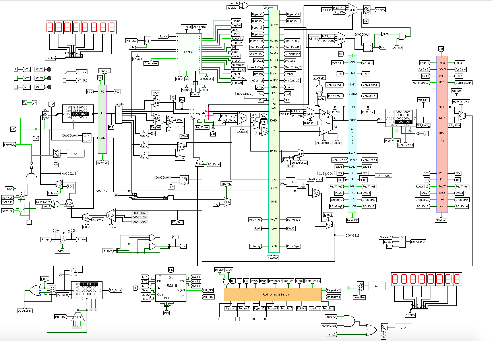
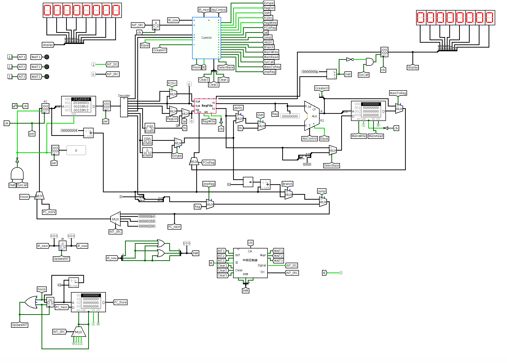

# MIPS CPU

This is a simple MIPS CPU written in Verilog and Logisim.

**Features**
* 31 instructions
* Five-segment pipeline
* Redirect & Bubble
* Branch prediction(Verilog version)
* Interrupt support(Logisim version)

**ScreenShots**

Logisim Pipeline Data Path:

Logisim Interrupt Version Data Path:

